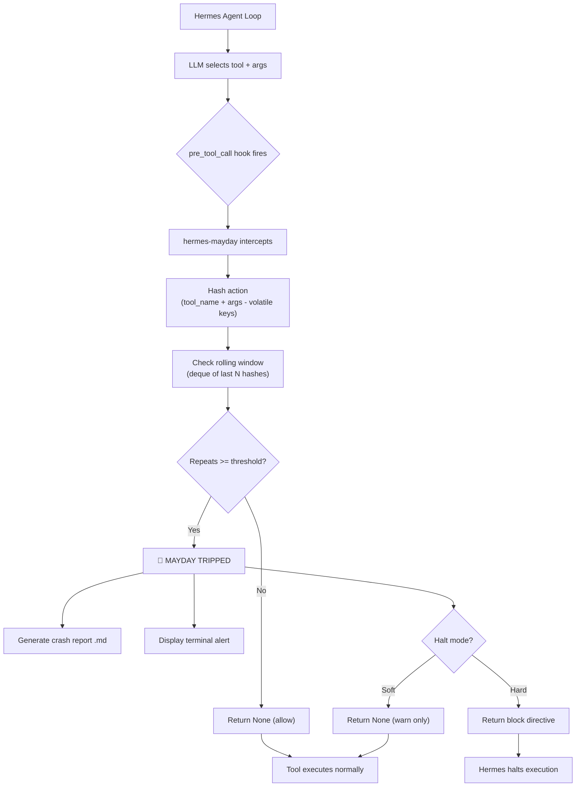
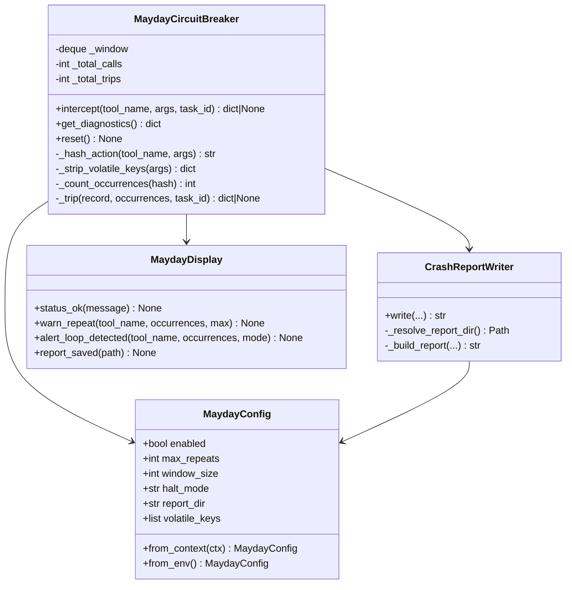
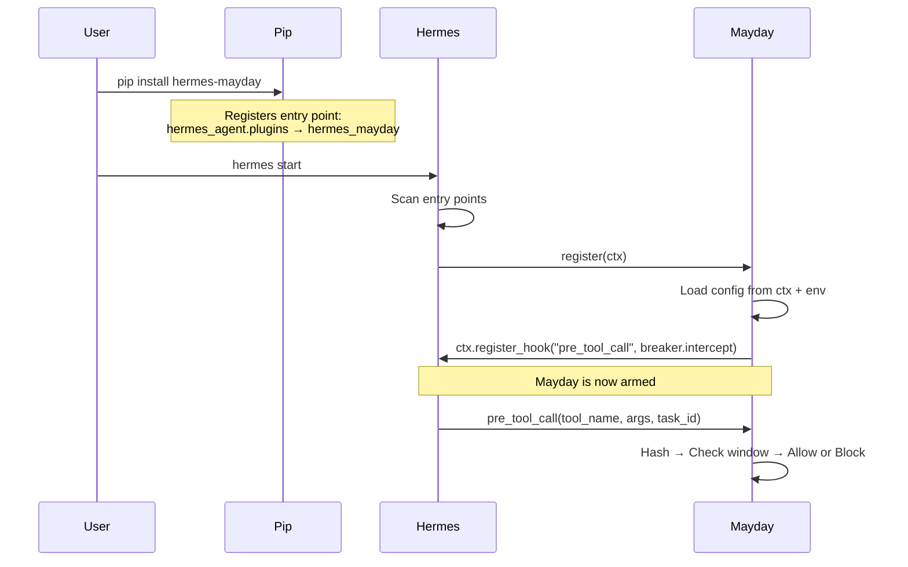

# hermes-mayday — Architecture

## How Mayday Intercepts the Hermes Execution Loop

```mermaid
flowchart TD
    A["Hermes Agent Loop"] --> B["LLM selects tool + args"]
    B --> C{"pre_tool_call hook fires"}
    C --> D["hermes-mayday intercepts"]
    D --> E["Hash action<br/>(tool_name + args - volatile keys)"]
    E --> F["Check rolling window<br/>(deque of last N hashes)"]
    F --> G{"Repeats >= threshold?"}
    G -- No --> H["Return None (allow)"]
    H --> I["Tool executes normally"]
    G -- Yes --> J["🚨 MAYDAY TRIPPED"]
    J --> K["Generate crash report .md"]
    J --> L["Display terminal alert"]
    J --> M{"Halt mode?"}
    M -- Hard --> N["Return block directive"]
    N --> O["Hermes halts execution"]
    M -- Soft --> P["Return None (warn only)"]
    P --> I
```

## Component Architecture

```mermaid
classDiagram
    class MaydayConfig {
        +bool enabled
        +int max_repeats
        +int window_size
        +str halt_mode
        +str report_dir
        +list volatile_keys
        +from_context(ctx) MaydayConfig
        +from_env() MaydayConfig
    }

    class MaydayCircuitBreaker {
        -deque _window
        -int _total_calls
        -int _total_trips
        +intercept(tool_name, args, task_id) dict|None
        +get_diagnostics() dict
        +reset() None
        -_hash_action(tool_name, args) str
        -_strip_volatile_keys(args) dict
        -_count_occurrences(hash) int
        -_trip(record, occurrences, task_id) dict|None
    }

    class CrashReportWriter {
        +write(...) str
        -_resolve_report_dir() Path
        -_build_report(...) str
    }

    class MaydayDisplay {
        +status_ok(message) None
        +warn_repeat(tool_name, occurrences, max) None
        +alert_loop_detected(tool_name, occurrences, mode) None
        +report_saved(path) None
    }

    MaydayCircuitBreaker --> MaydayConfig
    MaydayCircuitBreaker --> CrashReportWriter
    MaydayCircuitBreaker --> MaydayDisplay
    CrashReportWriter --> MaydayConfig
```

## Plugin Discovery Flow

```mermaid
sequenceDiagram
    participant User
    participant Pip
    participant Hermes
    participant Mayday

    User->>Pip: pip install hermes-mayday
    Note over Pip: Registers entry point:<br/>hermes_agent.plugins → hermes_mayday
    User->>Hermes: hermes start
    Hermes->>Hermes: Scan entry points
    Hermes->>Mayday: register(ctx)
    Mayday->>Mayday: Load config from ctx + env
    Mayday->>Hermes: ctx.register_hook("pre_tool_call", breaker.intercept)
    Note over Hermes,Mayday: Mayday is now armed
    Hermes->>Mayday: pre_tool_call(tool_name, args, task_id)
    Mayday->>Mayday: Hash → Check window → Allow or Block
```
